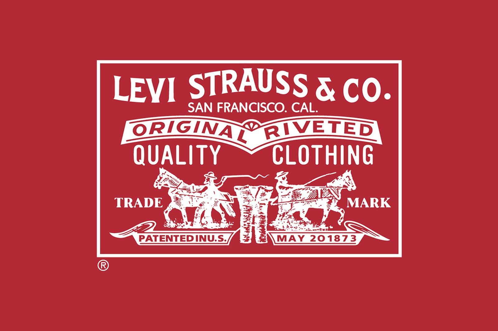
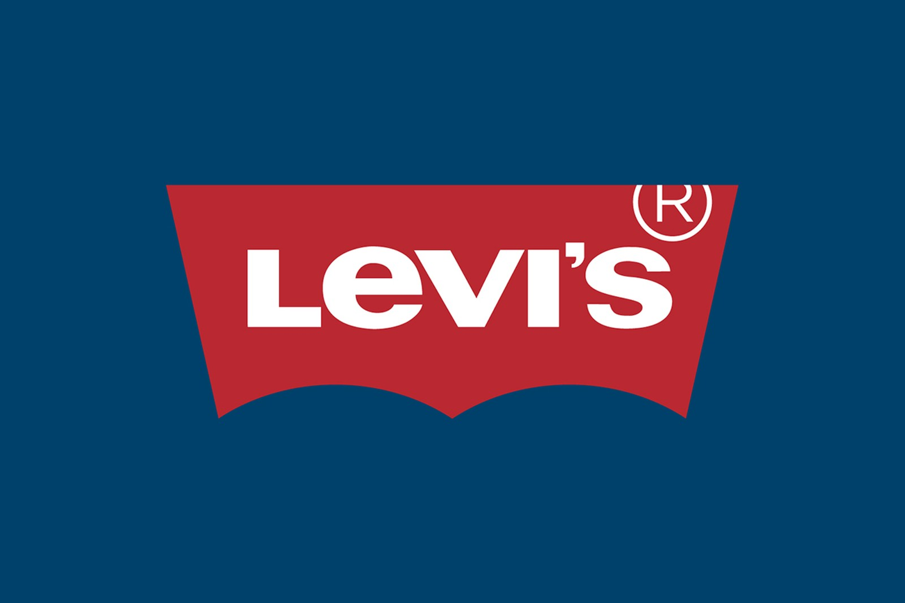

Levi’s is the oldest clothing brand in the USA it was founded in 1872 by Levi Strauss, a German immigrant in the USA. At the time he worked as a gold miner, but he decided to change his lifestyle and had the brilliant idea of start selling special clothes for the gold diggers. The clothes had to be made with a special fabric to achieve the gold diggers’ needs, it had to be strong and durable. And it was at that point that Levi’s emerged. When someone thinks about a pair of jeans, immediately comes to mind a pair of 501s. These pants are stored with history, as being the original blue jeans, and being in the market for so long, it would be normal that people like Kanye, my dad, my school teachers and Steve Jobs collect a pair of these jeans in their wardrobe. Besides having an amazing material, detailed construction and being durable is the Two Horse, Red Tab and Batwing Logo that instantly evidences the authentic pair of Levi’s.

In 1886, Levi’s began to being recognized by their Two Horse logo. It consisted of having two horses, each pulling in the opposite direction, tearing the jeans in half but showing that the jeans would not rip apart, emphasising the quality of their brand. They were a company with pride, heritage and innovation. Another good reason for them to use this logo, was because they were aware that not all of their costumers spoke English as their first language or that even the ones that did, were not literate. The image of the two horses became memorable and people went to local stores and ask for “those pants with the two horses”, and they would buy a pair of Levi’s jeans.

The red colour has always been present in Levi’s presentation as a brand, it demonstrates passion and excitement, young and playful. It also gives a sense of energy and comfort. The typography used in this specific logo consists in capital letters, all in white, with the name of the brand in bold and “quality” and “clothing” bigger than the rest of the other words, to demonstrate the goal of the brand.

In 1936, rivals started to imitate Levi’s jeans so the brand decided to sew a little Red Tab at the back pocket to distinguish from imitations. And the Levi’s began to being recognized by their Batwing logo with big capital white letters, excluding the letter “e” that is always written in lowercase, which at the time seemed to be a courageous decision.

The batwing format represents the back pockets of their iconic jeans. Levi’s logo and typography are untouchable and bring a legacy to the brand. 

Anyone can recognize a pair of jeans from Levi’s, it made a mark in the fashion world, not only for their commitment to quality and being worried about their costumers but also because it made an impact back when it was created and it continuous of doing that until today.