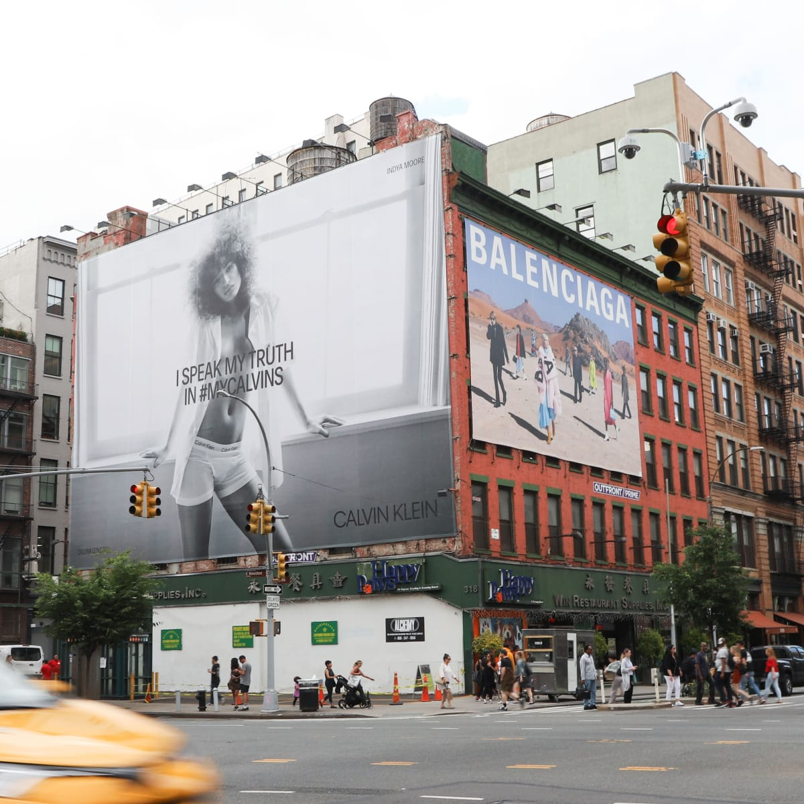
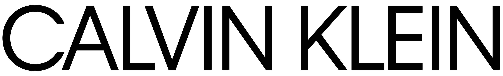

It’s normal to see an advertisement with beautiful models using Calvin Klein underwear, and everyone that sees it, wants to wear it, that’s the power that Calvin Klein has over people. Which is a good thing, and they know it. Using Calvin Klein gives you a feeling of being sexy and belonging to a certain club of people. But when did all of this started? How did this brand achieve this status?

Calvin Klein was a famous designer since the 70s, he was well known for his advertisements instead of any piece of clothing. With only 10,000 dollars Klein decided to open a coat shop in 1968, and it didn’t take long for thousands of people started buying his clothes. The next year, Calvin Klein featured in a Vogue cover and from that point on his career was launched.

He launched women’s lingerie and after a while, he began to sell also menswear. At the end of the 70s decade, Klein decided to launch jeans to his collection of clothes, which made a huge success back in the day and it is still very popular nowadays. Klein knew that advertising would play a huge part in his business, so since from the begging, he would ask celebrities to make photoshoots with his underwear. Until today, the advertisements play a big role and we can find them everywhere including big billboards, Instagram posts and advertisements on YouTube grab our attention.

Calvin Klein logo is iconic and unique. It shows the brand identity. The typography of the logo changed during the years of its existence. In 1968 the logo was created, and it was used like that until 1975. It consisted of having the simple name “Calkin Klein” written on it, in black, the “C” and “K” as capital letters, in a thinner and stylish font, no serifs. It showed the brand sophistication, elegance and authority. With their typography, they demonstrated confidence and power. Something to be remembered of.

Between 1975 and 1992 the typography was updated. Some little changes happened like the letters had a bigger contrast, became semibold and the height of the lowercase “I”, “l” and the capital “C”, “k” is the same.

During the period of 1992 and 2017, the letters became thinner and even though the style changed, the font remained the same. Another difference was that the dot above the “i” became a rectangle. A subtle change was also made in the space between the letters, they became a little bit more separated from each other.

In 2017 the brand redesigned their typography completely. All letters were changed to upper case, they became thicker and stronger. The designer of the logo wanted to return the brand spirit to the original way that it was when Calvin Klein was founded. In addition to having incredible typography and recognized in every place, the brand has also its abbreviation “CK”, that it’s now used in everyday life.

Calvin Klein’s typography concept is in being minimalist. Is expressing their brand and image by being simple and consent. It is to make people associate only two letters with their clothes and underwear and all that the brand has to offer. It is in being able through typography show who they are.

