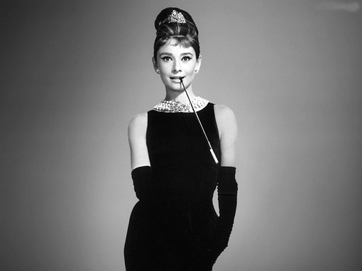

Coco Chanel was one of the first designers to stop following fashion tendencies. She was determinate to change the fashion industry of her time. She believed that clothing should be comfortable, with perfectly designed lines and stressing shapes. Her new vision about the fashion world was the key point to her success.

Gabrielle Bonheur Chanel was born in 1883 in France. She grew up in an orphanage and was raised by nuns after her mum died. The nuns eventually taught her how to sew, which would become a valuable lesson for her in the future. In 1910, at age of twenty, living in Paris, she opened her first store and began selling hats. With her success growing she opened two more stores in France and started to sell her own designs. Her business took off and she created the famous Chanel Number Five and the “little black dress”.

Chanel’s designs were elegant, luxurious and inspired by men’s wear. She was one of the first to set in motion fewer restricting clothes for women. As the effects of the first world war began to be felt by the upper classes, her designs became more popular because of the boxy lines and shorter skirts, which allowed women to do the activities that the war made necessary.

Her concept of fashion is reflected in her logo. It is composed of two interlaced and placed against each other “C” letters. The typography on this brand was created by Chanel’s handwriting and based on it a unique type was created. After that, the type was named “Chanel” and it is copyrighted. The font used is simple, minimalist and reflects the designs created by Coco Chanel. The font can be found in almost every piece of packing created by the fashion house. The black colour represents elegance and sophistication that Chanel stands for. The simple typography shows luxury and also stands for Chanel’s philosophy of “less is more”. It was created in 1925 and it has remained the same until today.

The logo is considered to be the reason for the brand's massive success and it is one of the most recognisable logos in the fashion world. The impact that it had on the brands business shows how a design can influence the triumph of a brand. 

Chanel was a woman that fought for her dreams and believes, she defied everything that was known in the fashion matter at her time. She did everything to bring her brand to life and that is shown until today, as Chanel being one of the biggest fashion brands of our days.