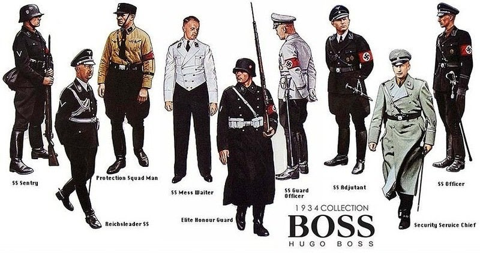
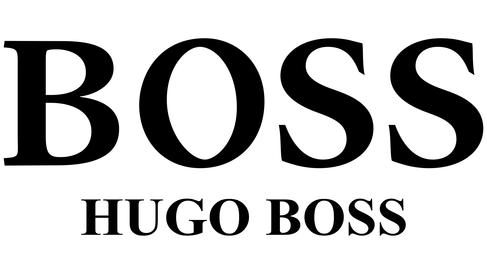

“Hugo Boss” is a name that implies images of high fashion, elegance and luxury. But what is the brand history? And it’s legacy? And what its typography says about it?

**The brands' history**

Hugo Boss is a brand of high end and exclusivity is as much as a cultural icon as it is a clothing company. Hugo Boss founded the brand in 1923, among a changing social and political environment. Established in Metzingen, Germany, the company started simple and faced economic challenges right at the beginning due to the economic downturn. Reconstructing his brand with only six sewing machines and a lot of debts, Hugo Boss joined the Nazi Party in 1931. Being part of the Nazi Party boosted Hugo Boss’s profits dramatically, elevating the company from almost bankrupt to the prosperous trader we know today. His involvement in politics was what cause the company to become a primary manufacturer of Nazi uniforms and by World War II, producing outfits for the German armed forces became the brands' main purpose.

History says that to be able to keep up with the number of products needing to be made, the company used slaves and prisoners of war to manufacture for them. His collaboration with the Nazi Party lasted until the end of the war, and he was charged with being an “activist” and a “supporter and beneficiary of National Socialism.” Consequently, it was taken away from him his voting rights, his capacity to run a business and he also got a fine of 70 thousand USD, which today would be equivalent of nearly 1 million USD.

Unfortunately, Boss died in 1948. But the brand lived on. Eugen Holy, his son-in-law took over and in 1950 the company received its first order for men’s suits and thus the legacy was reborn. Nowadays, the company holds core pillars like quality, innovation and responsibility. They also have been involved in charities promoting education and support in underdeveloped regions.

**About the typography and logo**

Unlike other fashion brands, in Hugo Boss’s there are no graphics on the branding trademark, only text. The typography transmits style and sophistication. The trademark structure consists of two inscriptions, arranged in two lines: at the top is the large word “BOSS” with serifs, at the bottom “Hugo Boss”, in small sans serif type. In the latter case, all letters are capitalized with wide spacing. The “HUGO” contains a different typeface – sleek and streamlined. The basic palette of the logo is monochrome (black and white). This interpretation makes the logo elegant, perfect and strict, conveying its clean essence.

