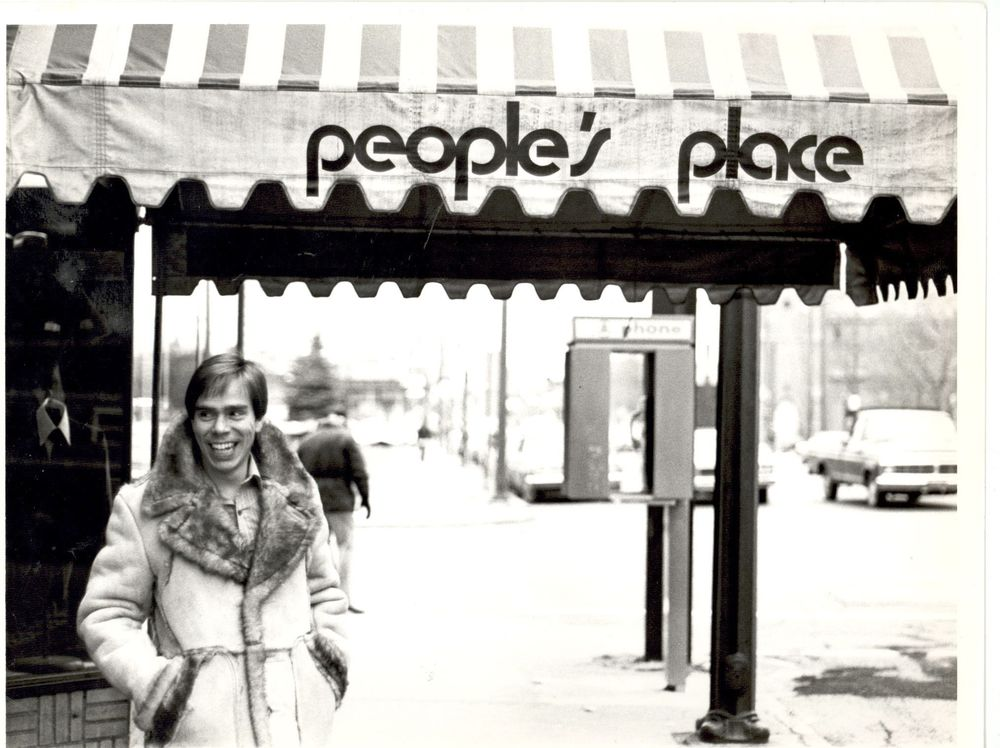
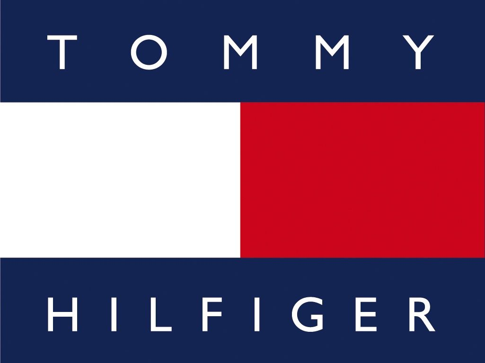

Cool, committed and classic are the formula of product creation at Tommy Hilfiger. But for the brand to get where it is today it took time, effort and love for the fashion world. The beginning was not easy for Tommy and he had a lot of challenges along the way to get his brand where it is today, and the start of this journey happened in 1985 when Hilfiger got its first major and displayed in the prime spot of Time Square, New York. In the next years to come, Tommy was being compared to Calvin Klein for top brands targeting males.

 Tommy Hilfiger started his business at an early age, opening a local store called People’s Place at the age of eighteen. Rapidly the store became known to the local youth for selling bottom jeans and hippie incense. Tommy tells that his “vision was always to design clothes of incredibly quality, great value and at an accessible price.”  Across the 30 years of the brands' existence, Hilfiger has turned his hand to nautical, sporty, rock & roll and American style. Mixing unique styles from the sixties and seventies with modern and athletic designs.

 

 Tommy Hilfiger campaign focused on two key aspects of the brand: the importance of America and the bran’s logo. It is hard to believe, but the letter “H” is encrypted in the graphic part of the logo. It is symbolized by two rectangles of white and red colours that are stacked horizontally. These two rectangles also coincide with the flag called “Hotel” from The International Code of Signs which is used when marines want to report the presence of a pilot on board. He chose this symbol because of the association of his name and the letter “H”. 

 Their logo represents the values of the company, which are based on a commitment to the American style. Consequently, it contains two dark blue stripes taken from the first US flag. They demonstrate the historical heritage and connect the fashion brand with the cultural past of America. The typography present on the long is complemented by the name “Tommy Hilfiger”, which is made in sans-serif capital letters with a font called Gill Sans. The same blue colour present on the flag of the logo is used on the typography, once again referring to America and what their brand stands for. Their typography or logo hasn’t changed since 1985 when it was created. All because it was originally the face of the brand: the visual identity determining the success of marketing that was built around the typography and logo.

