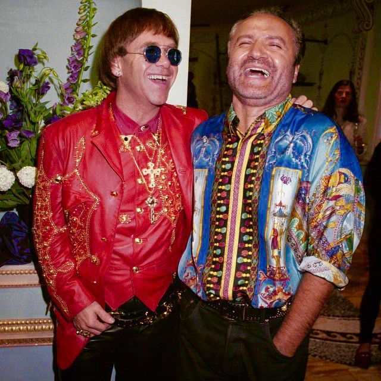
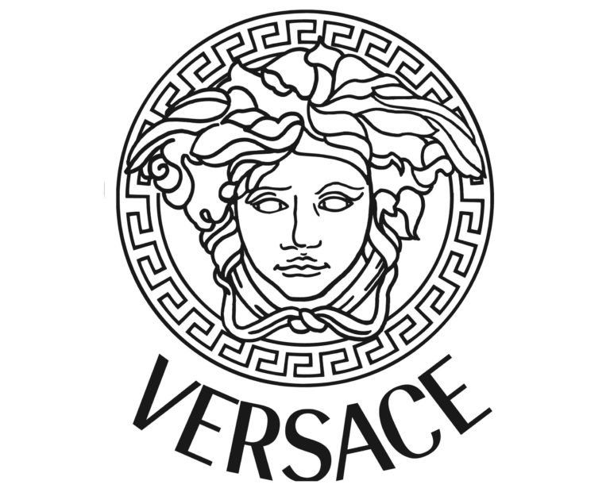

Versace has been one of the most well-known brands in the luxury fashion industry for the last forty years. What’s great is that the clothes they sell many times hit red carpets and are worn by many celebrities. We do know that incredible clothing is created by this fashion brand, but how much do we know about its history and typography?

**The brand history**

The history of this brand started in 1972 when Gianni Versace left Calabria and went to Milan, where he worked as a designer and created a collection for “Florentine Flowers” clothing company. He preferred to remain in Milan and had some collaborations with Callaghan, Complice and Genny as well. In 1978, the designer presented his first collection, which had its own name. The next move was to open a boutique that started rising in the years that followed. As he participated in numerous fashion shows and did all sorts of costumes and courses, his popularity began to rise even in London and soon enough he became an authority together with the Versace logo.

 Besides of having an amazing eye for design and that played a major role in Versace’s success, there was another reason that helped Versace as one of the premier fashion brands in the world – his connections to the music industry and his innovative approach to marketing. He was friends with a number of high-profile stars in the music industry, including Elton John, Eric Clapton, Naomi Campbell, Cher and Madonna. Gianni became one of the first designers to link the music industry with the fashion industry. Instantly, everyone wanted to wear the same dress that Cher had on or the same belt that Elton John was wearing, and that meant an inundation of new costumers for Versace, which brought richness and status to the company.

**Logo and typography**

The Versace logo has the head of Medusa, a character from the Greek mythology that was transformed into a Gorgon by the goddess Athena. The legend says that her hair was turned into black snakes and anyone that dared to see her would be turned into stone. Gianni was completely passionate by Greek mythology and art and that was one of the reasons why he chose to use the Medusa to represent his brand.

 Despite the interesting message of Medusa and the simplistic typography, there are several design elements of the Versace logo that make it a unique and attractive design. The logo is simple and lacks a particular colour scheme, which means it can be easily integrated into any piece of clothing without interfering the colour scheme of clothing itself. It is able to express the impression that Versace clothing is timeless and almost mythological in its nature by looking like a design from ancient Greece, something that the Greek gods and heroes themselves would have worn. Finally, it is undoubtedly distinctive and readily identifiable by anyone who is familiar with the fashion industry.

