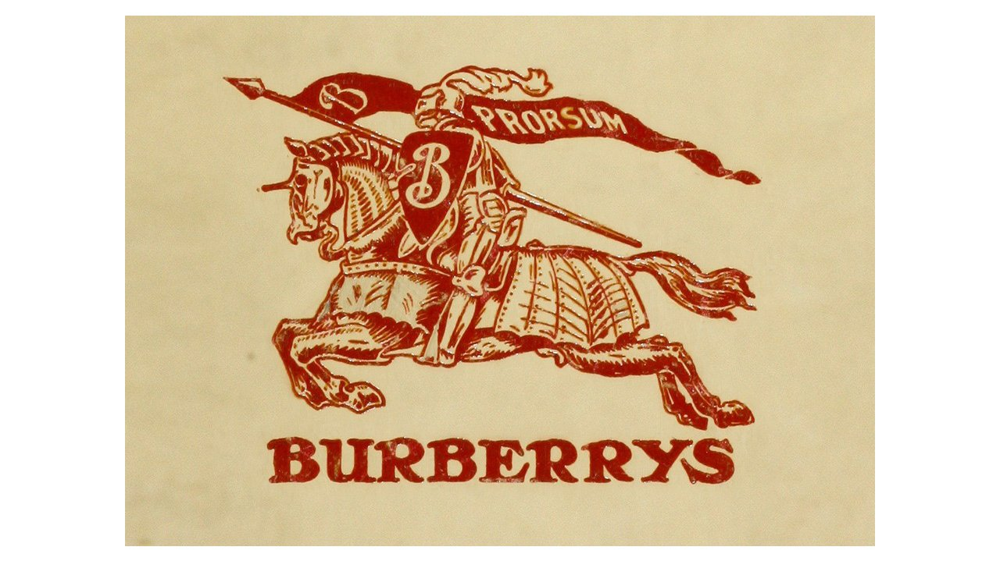
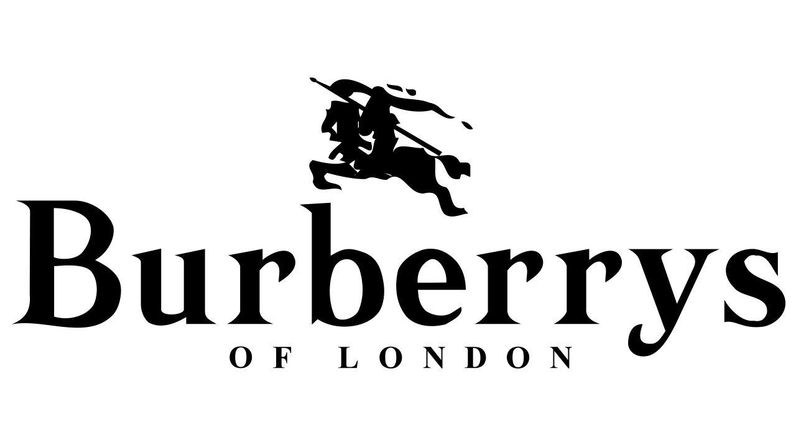
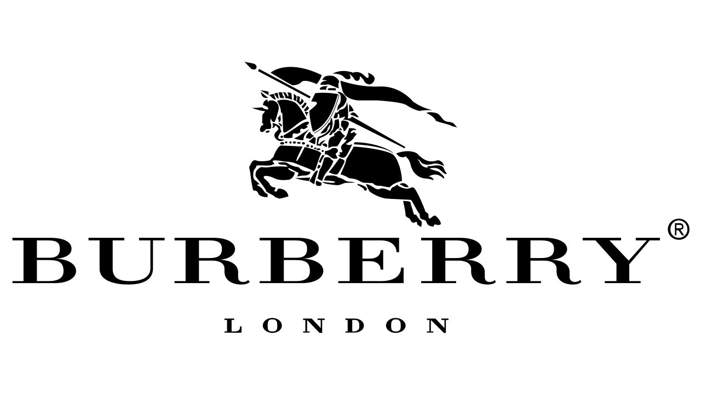

Steeped in heritage with a signature trench coat collection that dates back to 1800s, Burberry represents stereotypical British style.

At the age of 21, Thomas Burberry founded his namesake label in 1856. But it was only in 2879 that he became famous for creating gabardine, the world’s first waterproof fabric. In 1888, he patented it, making Burberry’s its only stockist. Breathable, weatherproof and hard-wearing, gabardine made for the perfect trench coat material and was hailed as the lightweight alternative rubber.

The interest of gabardine lay in its functionality. In 1910, aviator Claude Grahame White famously wore the material to fly between London and Manchester in record time. The armed forces also were involved on gabardine’s practical qualities and Burberry’s became the apparel provider for British soldiers during both World Wars.

After several downfalls and problematic problems, Burberry was able to come back to the top, and still today remains one of the most important brands in the fashion industry. Not only for creating an element very important and wearable in everyone’s closets, but also for its story and reputation.

**Typography**

1901 - 1968

The very first logo for the fashion label was created in 1901 and featured a red emblem with a wordmark under it. The pike had a weaving flag on it, with the lettering “Prorsum” (which means “forward”) and an ornate letter “B”, which was also drawn on the shield. The typeface was in all capitals in a bold serif type, looking solid and powerful.

1968 – 1999

In 1968 the wordmark becomes a star of the logo. The lettering is now in title case and has a delicate “Of London” tagline in all caps, written in the same serif typeface as the main inscription. Now it looked more like a fashion brand visual identity, with elegance and style.

1999 – 2018

The redesign in 1999 made the wordmark a little smaller. The inscription is now in all capitals of an elegant serif typeface, which is very similar to Badoni Family fonts, with sleek sophisticated lines and thin serifs. The “Of” part is removed from the tagline, now it is just “London” in capital letters. Looks professional and classy.

2018 – Today

The actual Burberry visual identity was created in 2018 and is a reflection of the new era of the brand. The new Burberry wordmark in all capitals is executed in a modern sans-serif typeface, designed by Dieter Hofrichter.

