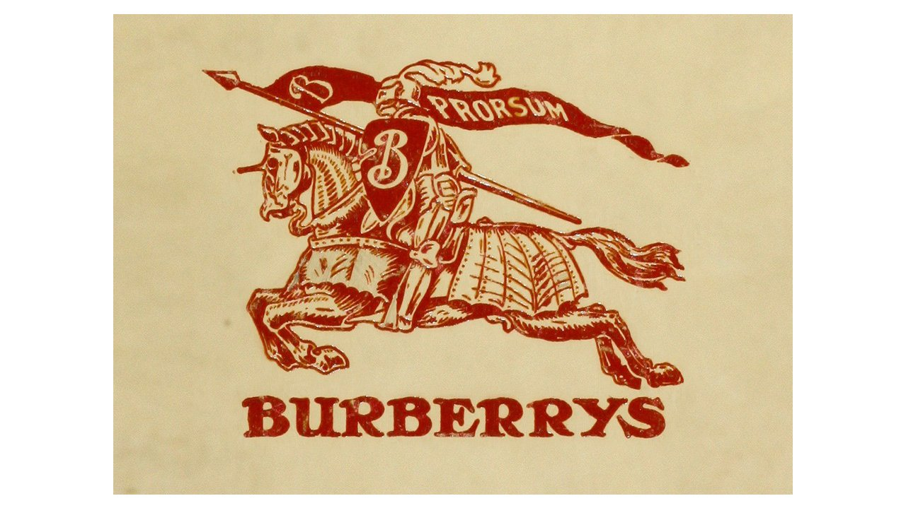

Many are surprised to find that the eponymous French fashion house actually started out as a made to measure children’s shoe shop. In 1945 after WWII, Céline Vipiana, with her husband, opened their boutique to offer made to order custom shoes that soon became well-known for their style. In the late 1950s the couple decided it was time to migrate into women’s footwear, and soon expanded their operation to include additional accessories and women’s ready-to-wear sports collection. Céline’s designs became a new type of contemporary that was more about functionality than frivolity, to make this idea come to life, she used at first such fabrics like denim, leather, and wool. After another ten years, the boutique expanded its lines to accessories and fragrances.

 **Typography**

In 1970, when the brand changed its direction, was when the first logo was introduced, and with it its first typography.

1973 – 1990

The logo for Céline, designed in 1973, featured a bold sans-serif logotype in monochrome, executed in clean lines with traditional shapes. The letters were placed very close to each other and were accompanied by a black emblem placed above it. The emblem depicted a man in a carriage with a horse, moving from right to left. The delicate “Paris” tagline was placed under the main nameplate in small capitals. All elements were in black and that didn’t change thorough the brand’s history.

1990-2012

The redesign of 1990 made the logotype the only element of the brand’s visual identity. The neat and bold sans-serif letters were placed pretty far from each other, creating a sense of lightness and elegance. The airy wordmark was executed in a font that was very close to Neue Helvetica.

2012-2018

In 2012 the logo was changed again, and this is when the accent about the letter “E” appears. It adds unique style and character to a simple monochrome inscription, making the logo recognizable and memorable. The lines of this vision were bolder than on the previous one, and the letters were placed closer to each other, creating a balanced and solid look. The typeface of this version is similar to Futura BT Pro Medium.

2018- Today

The new director, Heidi Slimane, decided to change the logo again in 2018. The accent above the letter “E” is being removed and the typeface changed to a more modern and bolder one. The new typeface is sans-serif, very similar to Semplicita Pro SemiBold, white wide contours and distinct lines.

These explanation for these changes are that in the era of globalism and digital communication a brand needs to change and evolve in order to survive and progress.