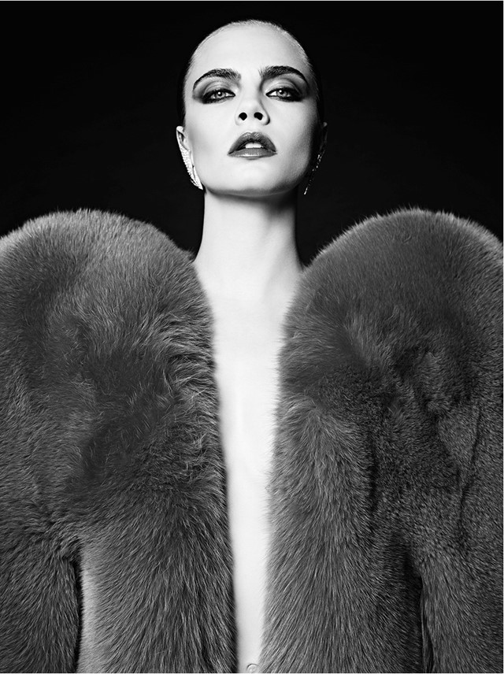
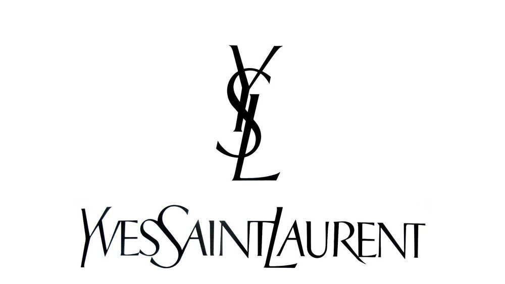

**The history**

 Founded in 1961, Yves Saint Laurent is one of the most important and well-known fashion houses in the 20th century. Originally a House of Haute Couture, Yves Saint Laurent revolutionized modern fashion in 1966 with the introduction of the luxury ready-to-wear under the name Saint Laurent Rive Gauche.

Over the years, Yves Saint Laurent has held an enormous influence inside and outside the fashion industry. Its founder, the couturier Yves Saint Laurent secured a reputation as one of the 20th century’s greatest designers and personalities. Yves Saint Laurent’s creativity was the heart of the brand, pushing boundaries forward, and he was never afraid of shocking or provoking in the name of empowerment and freedom of thoughts. The Maison was the first one to be at the same time revolutionary and luxury, and this spirit is at the basis of its DNA.

Back in 1961 he introduced a revolutionary take on women’s clothing. Inspired by the structure of menswear and the feeling of power that came with wearing it, his approach was a celebration of gender fluidity that shook the fashion industry.

What set Saint Laurent aside from his peers was his fearless approach to blurring the lines between men’s and women’s fashion and his celebration of female sexuality. He took traditionally masculine items and made them work for a new kind of womenswear. It was a time of change in the fashion industry.

 

**Typography**

The YSL identity is one of the more famous and contentious icons in the world of designer fashion, especially in recent years. The logo was brilliantly made and it blends the letterforms with exceptional harmony, mixing sans and serifs in a subtle way, while successfully mixing rodman and italic forms at the same time. This is what makes the YSL logo so especial and inimitable. The words flow from left to right, creating a beautiful rhythm between the capitals and the small capitals. A combination that works perfectly and makes this a unique gem of graphic identity.

It has become not only a synonym of the ultimate luxury brand, but also a symbol of quality. Three capital letters are turned into a charmingly elegant monogram that when left by itself still stands for most, if not all, of the values mentioned.

In 2012 the typography was changed and the name as well, the brand it is now called Saint Laurent Paris. The “Saint Laurent” is in Helvetica Neue Bold capital letters in black and the “Paris” comes underneath it. It still transmits the same luxury and power of the brand.

