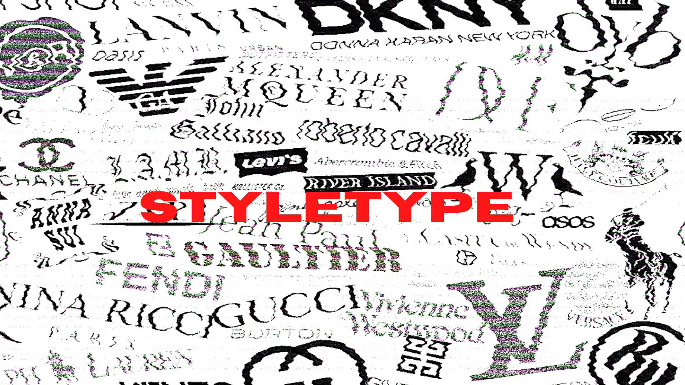
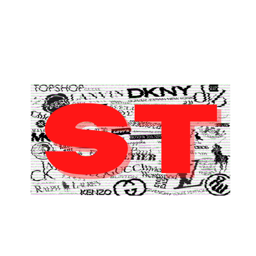

## About Me

My name is Sabrina Andrade, I'm currently a second-year student of Media, Journalism and Publishing at Oxford Brookes University. I was born in Brazil, but I grew up in Portugal and when I was 19 I moved to France and lived there for about 2 years. I always had the desire to study in England, so when I had the opportunity to do so, I came and here I am until now. It has been a crazy and amazing journey, I learned a lot and had experiences that I'll cherish forever. 

## About the Blog

I decided to create this blog about fashion and clothing brands because it has been something that I'm really interested in and I thought that it would be interesting to analyse the typography and design of this sector. In it, I try the explore multiple different brands clothing and their respective history and what impact they had in the fashion world. 

My landing imagine is composed by my banner and my logo. The banner has a black and white black background with various names of clothing brands and at the centre in bold, red and capital letters the name "StyleType" which is the name of my blog, I used the red colour to the name because red symbolises passion, energy and excitement, which is what I want to transmit by my blog and it is what I feel when I'm writing it.

 The logo is just the bold, red, capital letters "ST" that stands for "StyleType", with the same background used in the banner to keep everything with the same theme and atmosphere.

